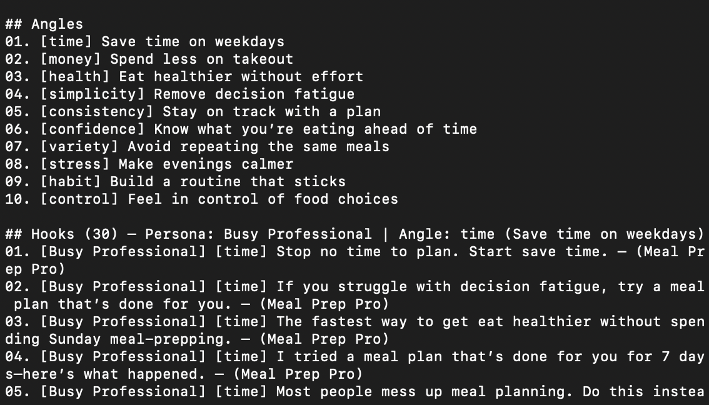

# AI Growth Automation

Small tools that increase output across acquisition, experimentation, and lifecycle.

The focus is leverage — producing more variants and ideas with less manual work.

---

## Current Tools

### Ad Creative Generator

Generate batches of hooks, headlines, and concepts from a single prompt.

Use cases:

* Rapid creative testing
* Messaging exploration
* Persona variations

## Example Output

### Terminal batch generation
This tool generates creative batches for experiments and ad testing in seconds.

---

### Landing Page Variant Generator

Create multiple hero sections and value propositions for A/B tests.

Outputs:

* Headlines
* Subheadlines
* CTA ideas
* Proof angles

---

### Lifecycle Email Drafting

Generate onboarding and retention sequences using product context.

---

## Workflow

1. Define experiment goal
2. Generate variants
3. Select top candidates
4. Ship tests
5. Feed learnings back into prompts

---

## Why this exists

Creative production is a growth bottleneck.
Automation removes that constraint.

---

## Future Directions

* Prompt libraries by funnel stage
* Experiment backlog → auto variant generation
* Performance feedback loops
* AI agents proposing experiments
